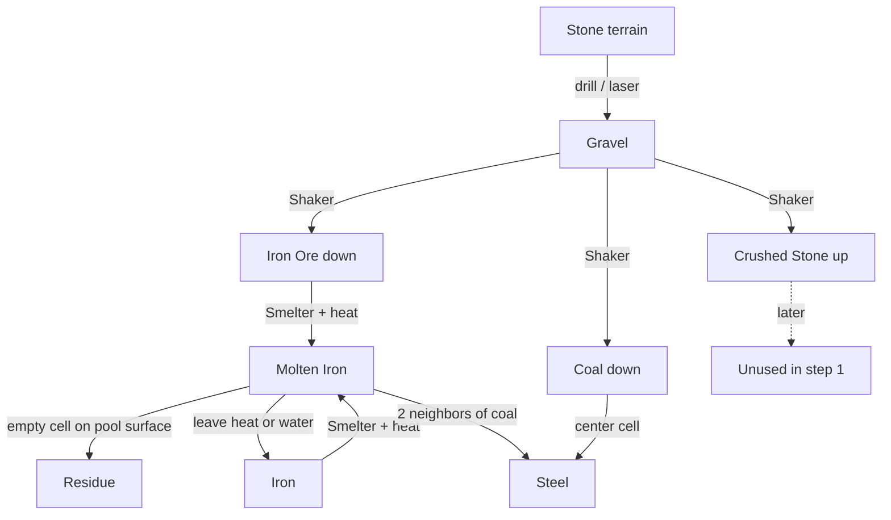
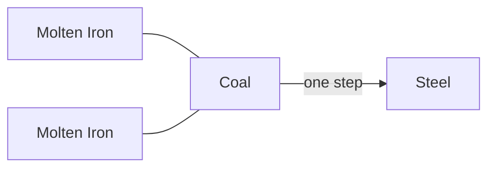
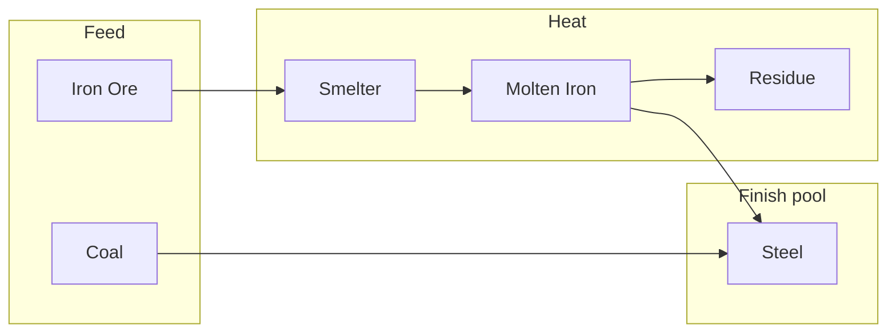
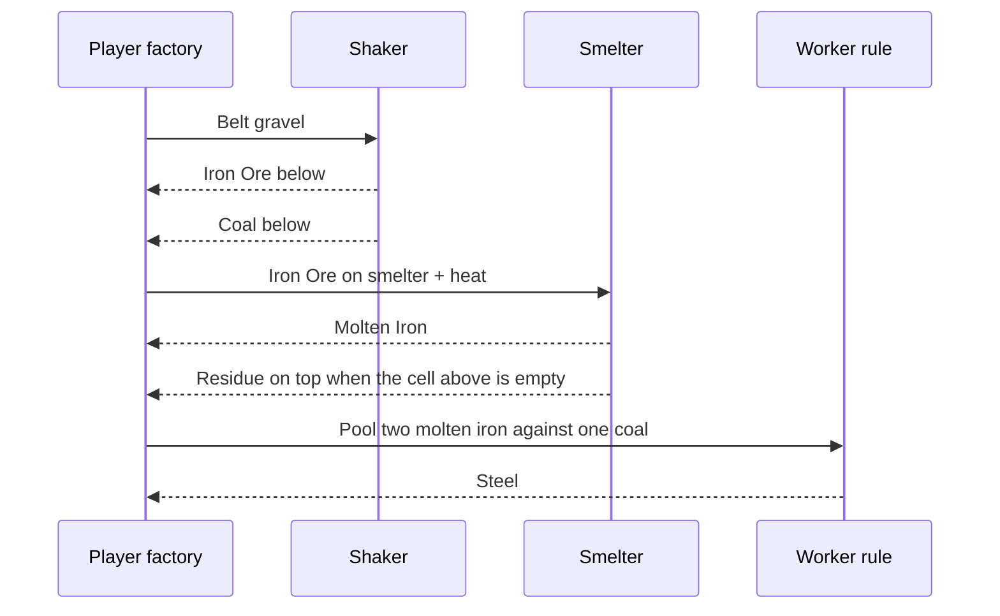
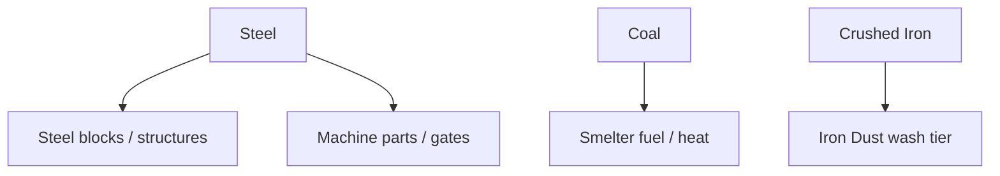

# Steel line

Iron and coal from the gravel shaker feed a short **steel** factory.
Vanilla machine: **Smelter**.
Steel finish is a **neighbor rule** on the worker (not a contact recipe).
No vanilla gold / copper / sand in this loop.

Smelting **Iron Ore** makes **Molten Iron**.
A fresh melt on the smelter also leaves one **Residue** cell.
Residue appears in the first empty cell above the melt, so a deep molten pool still gets slag on its surface.
Residue is light, so it floats on the molten iron.
Molten iron stays liquid while it sits on heat (**smelter** below, **lava**, or **fire**).
Away from heat it becomes solid **Iron** after a few pulses.
**Water** on molten iron quenches it at once (water → **steam**, molten → **Iron**).
The smelter can remelt **Iron** back into molten iron.
**Coal** surrounded by **two molten iron** neighbors becomes **steel** in one step.

**Net recipe:** 2 molten iron + 1 coal → 1 steel (no middle product).

## Step 1 (shipped)

| Step | Machine / rule | In → Out |
| --- | --- | --- |
| 0 (hub) | Drill / laser + Shaker | Stone → Gravel → **Iron Ore** (down) + **Coal** (down) |
| 1a | Smelter (needs heat) | **Iron Ore** or **Iron** → **Molten Iron**, plus one **Residue** cell on the melt surface |
| 1a′ | Cool / quench | **Molten Iron** → **Iron** (leave heat, or touch water) |
| 1b | Neighbor rule | **Coal** with **2 molten iron** neighbors → **Steel** (consumes coal + both irons) |

**Steel** is the usable product for now (no further sink yet).

### Full loop

### Neighbor finish

Coal must have **at least two** molten-iron cells in its 8-neighborhood.
Those two irons and the coal are removed; **Steel** appears where the coal was.

### Step 1 factory street

### Player sequence

## Why this shape

- **Smelter** melts ore to iron and leaves a light residue cap.
- Steel still needs coal.
- **2 molten iron neighbors on coal** is one conversion, no pig-iron middle step, and forces pooling.
- **Crushed Stone** stays out of the steel line for now (see [`ideas.md`](ideas.md)).

## Later (not step 1)

| Idea | Notes |
| --- | --- |
| Steel blocks | Compress / build sink |
| Coal as heat | Replace or assist lava under smelter |
| Iron dust | Extra press / wash before smelt |
| Quench with water | Shipped: water + molten iron → steam + iron |

## Element quick ref

| Element | Matter | Role |
| --- | --- | --- |
| Iron Ore | Solid (heavy) | Shaker down |
| Coal | Slushy (heavy) | Shaker down; needs 2 molten iron neighbors |
| Molten Iron | Liquid | Smelter product; lava-style fire pulse; two neighbors of coal |
| Iron | Solid (heavy) | Cooled molten iron; remeltable |
| Residue | Slushy (vanilla) | Light slag on top of a fresh melt |
| Steel | Solid (heavy) | Step 1 end product |
