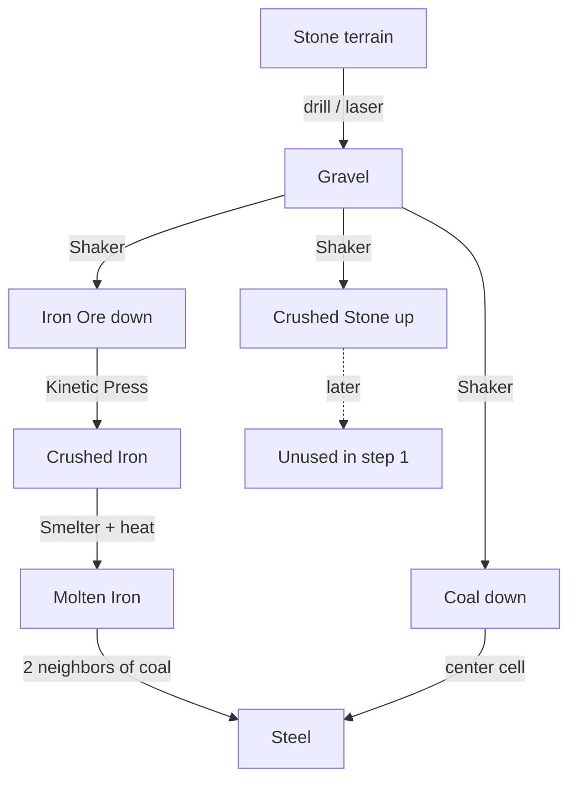
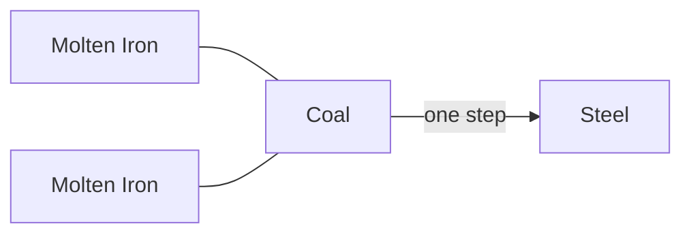
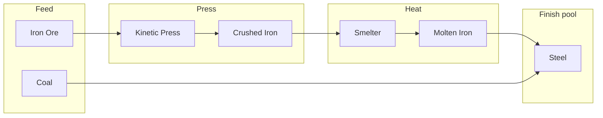
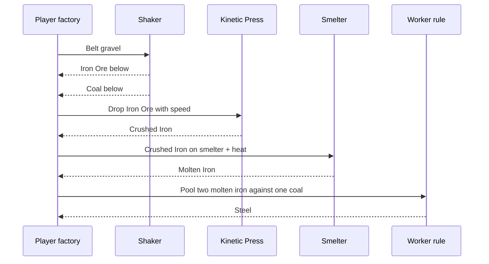
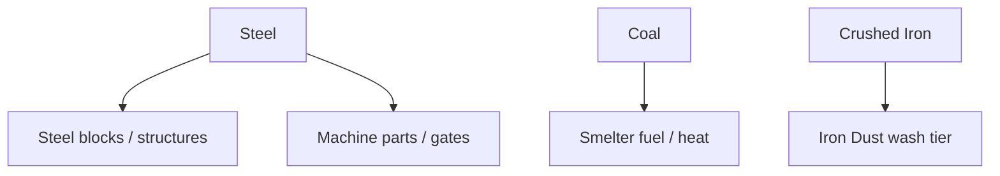

# Steel line

Iron and coal from the gravel shaker feed a short **steel** factory.
Vanilla machines: **Kinetic Press** and **Smelter**.
Steel finish is a **neighbor rule** on the worker (not a contact recipe).
No vanilla gold / copper / sand in this loop.

Smelting alone makes **molten iron**.
**Coal** surrounded by **two molten iron** neighbors becomes **steel** in one step.

**Net recipe:** 2 molten iron + 1 coal → 1 steel (no middle product).

## Step 1 (shipped)

| Step | Machine / rule | In → Out |
| --- | --- | --- |
| 0 (hub) | Drill / laser + Shaker | Stone → Gravel → **Iron Ore** (down) + **Coal** (down) |
| 1a | Kinetic Press | **Iron Ore** → **Crushed Iron** |
| 1b | Smelter (needs heat) | **Crushed Iron** → **Molten Iron** |
| 1c | Neighbor rule | **Coal** with **2 molten iron** neighbors → **Steel** (consumes coal + both irons) |

**Steel** is the usable product for now (no further sink yet).

### Full loop

### Neighbor finish

Coal must have **at least two** molten-iron cells in its 8-neighborhood.
Those two irons and the coal are removed; **Steel** appears where the coal was.

### Step 1 factory street

### Player sequence

## Why this shape

- **Press** matches Ex Nihilo “hammer ore → crushed.”
- **Smelter** melts iron only — no steel without carbon.
- **2 molten iron neighbors on coal** is one conversion, no pig-iron middle step, and forces pooling.
- **Crushed Stone** stays out of the steel line for now (see [`ideas.md`](ideas.md)).

## Later (not step 1)

| Idea | Notes |
| --- | --- |
| Steel blocks | Compress / build sink |
| Coal as heat | Replace or assist lava under smelter |
| Iron dust | Extra press / wash before smelt |
| Quench with water | Cool molten iron without making steel |

## Element quick ref

| Element | Matter | Role |
| --- | --- | --- |
| Iron Ore | Solid (heavy) | Shaker down |
| Coal | Slushy (heavy) | Shaker down; needs 2 molten iron neighbors |
| Crushed Iron | Solid | Press product; smelter feed |
| Molten Iron | Liquid | Smelter product; two neighbors of coal |
| Steel | Solid (heavy) | Step 1 end product |
