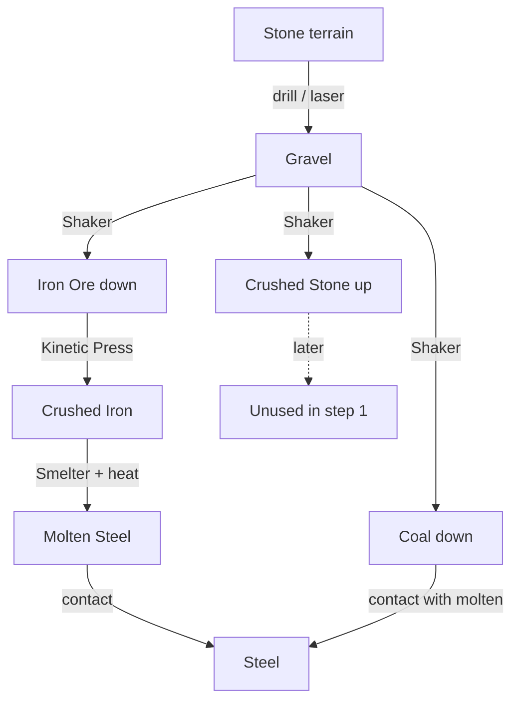
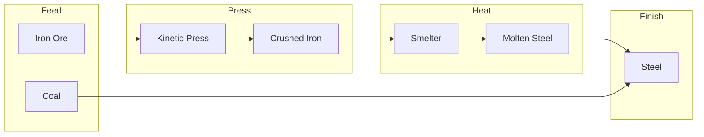
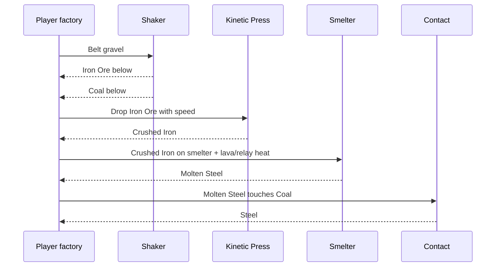
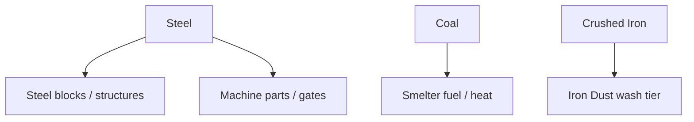

# Steel line

Iron and coal from the gravel shaker feed a short **steel** factory.
Vanilla machines only: **Kinetic Press**, **Smelter**, and element **contact**.
No vanilla gold / copper / sand in this loop.

## Step 1 (shipped)

| Step | Machine / rule | In → Out |
| --- | --- | --- |
| 0 (hub) | Drill / laser + Shaker | Stone → Gravel → **Iron Ore** (down) + **Coal** (down) |
| 1a | Kinetic Press | **Iron Ore** → **Crushed Iron** |
| 1b | Smelter (needs heat) | **Crushed Iron** → **Molten Steel** |
| 1c | Contact | **Molten Steel** + **Coal** → **Steel** + (coal consumed) |

**Steel** is the usable product for now (no further sink yet).

### Full loop

### Step 1 factory street

### Player sequence

## Why this shape

- **Press** matches Ex Nihilo “hammer ore → crushed.”
- **Smelter** matches “melt for metal” and reuses vanilla heat rules (relay / lava).
- **Coal finishes molten → steel** so both shaker downs matter in step 1.
- **Crushed Stone** stays out of the steel line for now (see [`ideas.md`](ideas.md)).

## Later (not step 1)

| Idea | Notes |
| --- | --- |
| Steel blocks | Compress / build sink |
| Coal as heat | Replace or assist lava under smelter |
| Iron dust | Extra press / wash before smelt |
| Quench with water | Alternate finish instead of coal |

## Element quick ref

| Element | Matter | Role |
| --- | --- | --- |
| Iron Ore | Powder | Shaker down |
| Coal | Powder | Shaker down; finishes molten → steel |
| Crushed Iron | Powder | Press product; smelter feed |
| Molten Steel | Liquid | Smelter product |
| Steel | Powder | Step 1 end product |
